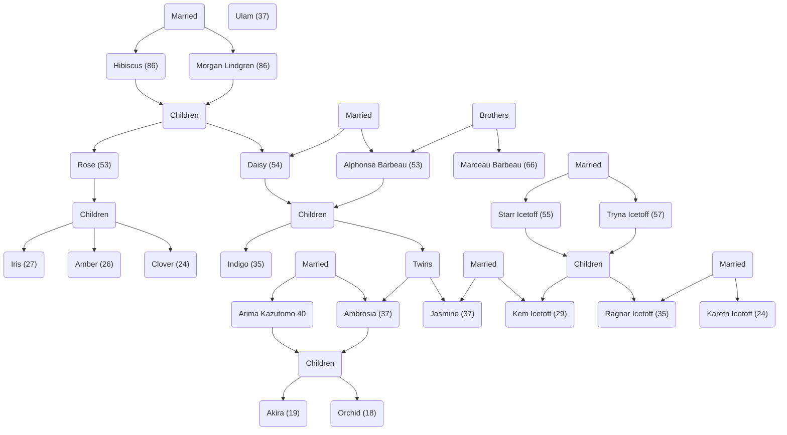

# Cast Of Characters

```mermaid
flowchart
  Hibiscus("Hibiscus (86)")
  Morgan("Morgan Lindgren (86)")
  Alphonse("Alphonse Barbeau (53)")
  Daisy("Daisy (54)")
  Indigo("Indigo (35)")
  Ambrosia("Ambrosia (37)")
  Arima("Arima Kazutomo 40")
  Iris("Iris (27)")
  Amber("Amber (26)")
  Clover("Clover (24)")
  Marceau("Marceau Barbeau (66)")
  Jasmine("Jasmine (37)")
  Kem("Kem Icetoff (29)")
  Starr("Starr Icetoff (55)")
  Tryna("Tryna Icetoff (57)")
  Ragnar("Ragnar Icetoff (35)")
  Rose("Rose (53)")
  Kareth("Kareth Icetoff (24)")
  hmMarried("Married")
  hmChildren("Children")
  daMarried("Married")
  daChildren("Children")
  aaMarried("Married")
  aaChildren("Children")
  rChildren("Children")
  amBrothers("Brothers")
  stMarried("Married")
  stChildren("Children")
  jkMarried("Married")
  Twins("Twins")
  rkMarried("Married")
  hmMarried --> Hibiscus --> hmChildren --> Rose --> rChildren --> Iris
  hmMarried --> Morgan --> hmChildren --> Daisy --> daChildren --> Indigo
  daMarried --> Daisy
  daMarried --> Alphonse --> daChildren --> Twins --> Ambrosia --> aaChildren --> Akira("Akira (19)")
  rChildren --> Amber
  rChildren --> Clover
  Twins --> Jasmine
  aaMarried --> Arima
  aaMarried --> Ambrosia
  jkMarried --> Jasmine
  jkMarried --> Kem
  Arima --> aaChildren --> Orchid("Orchid (18)")
  stMarried --> Starr --> stChildren --> Kem
  stMarried --> Tryna --> stChildren --> Ragnar
  amBrothers --> Alphonse
  amBrothers --> Marceau
  rkMarried --> Ragnar
  rkMarried --> Kareth
  Ulam("Ulam (37)")
```
