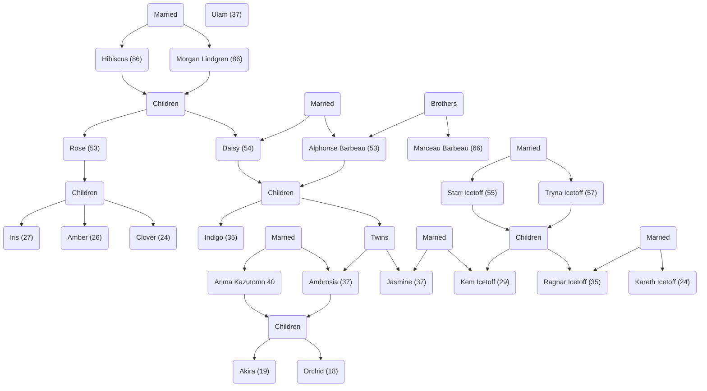

# Cast Of Characters

## Jasmine Or'lient

Languages: Swedish, Japanese, Swedanese, and English. Will change language based on who is present. Preference order Swedenese > Swedish > Japanese > English. Insists that others know at least English so that there is always a language they can communicate in.

<< Most things I would put here are elsewhere >>

## Kem Icetoff - XO & Wife

Languages: Yes. Practices with Daisy.

The Icetoff family was once Capellan, but was home to a world that ended up as a part of Rasalhague. Kem was born after that change, and her family adjusted fairly well to the change of pace. Being way out of the way from the Rasalhague itself, and on the fringe of Capellan space, there was some impact, but less than there was for Jasmine's family.

While Jasmine projects her personality as a protector and leader of the family, Kem works behind that with the actual people. Way more in tune with how people are feeling than Jasmine, Kem is able to keep her family and the unit running smoothly. She was assigned as a diplomatic liaison for Jasmine while she was working in Capellan space, and when told about Jasmine plan, was the first to accept to go along with it.

## Ulam - Chief Tech

Languages: Swedish. Barely knows English, only because Jasmine insists on a common language that isn't beholden to any one family.

Best way to describe this miscreant is with a quote.

"Ulam has been my technician since I joined the military. He was never high ranked, or interested in raising his rank, but always had a grander plan for each person's mech. His main fault would be that, to him, mechs are personal, and shouldn't ever 'just' have something replaced. He'll do it, because the enemy won't wait, but will always come up with a holistic plan and reasoning for any changes. Once I had my own command and could pick a chief tech, I put him in the position. He grumbled about it and still does, but he does like how he can come up with a plan and not have to do all the work." - Jasmine

## Ambrosia - Lance Leader & Older Twin Sister

Languages: Japanese, Swedish, Swedenese, and English

While twins, Jasmine is way more thoughtful and cerebral than Ambrosia, who is very hands on.

While Jasmine leads the unit, Ambrosia leads the Mech Lance. So while Jasmine is effectively a member of the lance, and outranks Ambrosia in general, Jasmine will defer to her if they are both on the field. So while Jasmine will be laying out the strategic goals and movements, Ambrosia will make sure the lance is armed, ready, and able to complete those goals.

Ambrosia married Arima Kazutomo from the Draconis Combine's military after they had a mock battle between their respective factions that ended in a draw. The Or'lient name actually had some weight (not much but some) even in Draconis Combine, so Arima took her name, and their four children (Akira, Orchid, Chrysanthemum, and Dahlia) are considered part of the Or'lient family.

She's the pilot of the BJ2-OB, but isn't as attached to it or it's look as Jasmine is to the MAD-5S look.

The elder two children (Akira, Orchid) have military training and are old enough, while Chrys and Dahlia are too young yet, but in training.

## Orchid - Lance XO & Eldest Daughter of Ambrosia

Languages: Japanese, Swedish, Swedenese, and English

Orchid really looks up to both her mother and Jasmine for what they've done. Ambrosia has the same emotional blindness that Jasmine can have, so Orchid takes on that role for her as Kem does for Jasmine. Spends a lot of time chatting with Kem and learning from her.

## Arima Kazutomo - Armoured Platoon Leader & Husband of Ambrosia

Languages: Japanese and English

Was an officer for the Draconis Combine for years before fighting to a draw with Ambrosia. After getting a permanent leg injury (playing soccer with Akira & Orchid, not in a battle to his chagrin), he was put on desk duty. With Jasmine scooping up his family, he retired, and Jasmine put him in the Puma, which while still without good use of his leg, can still command it effectively.

## Akira - Armoured Platoon XO & Son of Ambrosia & Arima

Languages: Japanese, Swedish, Swedenese, and English

A sniper in a local militia, and a licensed pilot, Akira is even more hands on for things that his mother. He joined Jasmine and moved his family early on, as he has heard many stories of what happened during the clan invasion from both sides of his family. Jasmine had him try some things out and see which VTOL would fit him, and the Hawk Moth was a perfect fit. At first they thought he'd pilot a transport, but being responsible for so many others and getting that close to combat both didn't sit well with him.

He's the Armoured Platoon XO to soften the impact the Rasalhague troops have with his DC father.

## Iris - Infantry Platoon Leader & Eldest of Aunt Rose

Languages: Swedish, and English

Iris has been in the military for only a shot while less than Jasmine, but was infiltration & special operations. She fills the same role now for Jasmine that she did before.

She has, by far, the most experience in charge of an infantry unit than anyone else in the unit, aside from Ragnar.

Husband died in a skirmish with bandits, while driving a truck. Their son, Clem, is an accountant, now helping with some finances on the ship.

## Amber - Infantry Platoon XO & Younger Sister of Iris

Languages: Swedish, and English

Just like Jasmine and Ambrosia are very different, Iris and Amber have a similar difference.

Amber is a born leader on and off the battlefield, that hates leading. Iris loves leading, but off the battlefield has her own world.

So Amber, aside from being XO, is basically the morale officer on the ship. She knows everyone, their families, who they may have had to leave behind, their family histories. All of it. But she seems to shine a bit too bright for her husbands, of which she is on her fourth. She has six children who all spend their time with their fathers. Two ex-husbands are actually traveling with them (all were asked), so that's four of her six children are with her.

She does not see eye to eye with Clem.

She travels with the Maxim, and it's 4 squads of infantry.

## Starr Icetoff - Sr. Medic & Father of Kem

Languages: Mandarin, and English. Also knows some Japanese and Swedish, but not a lot.

Skilled field doctor has been working usually out near the front lines of any conflict. However, since Ragnar wouldn't let his sister go alone, and Tryna wouldn't let either of them go alone, Starr didn't really need convincing.

## Indigo - Younger Brother

Languages: Swedish, Japanese, Swedenese, and English

Younger brother by almost 10 years to Ambrosia & Jasmine, he's way more mellow. He's the pilot of the Karnov transport, and very good at getting his 2 squads of BA to where they need to be. Almost didn't come along as he was a civilian pilot, but didn't want to miss watching his nieces and nephew grow up.

## Daisy - Mother

Languages: Yes. Daisy and Kem practice languages together just so they can keep fresh on them.

Daisy has been a coordinator and diplomat since an early age because she has a nack for language. She does 'know' more languages than Kem, and is most impressed by that about her.

Daisy serves as the communications expert and diplomat for the unit. While out and about, she has no issue deferring to Jasmine on goals and such, but Jasmine trusts Daisy to do the right thing by the family.

If contacting the unit in general, Daisy is the first to be contacted, but won't force it when someone is looking for the Unit Leader instead.

## Brant Crowley - Leader of the TAG Spotter Platoon

Languages: Swedish, Japanese, Swedenese

Given a permanent call sign after getting the only hit and kill for the team in it's first mission with the GSF.
