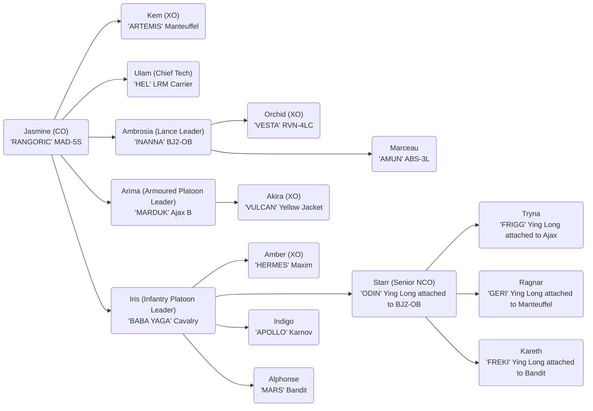

# Company Designation - Company Name

## Or'lient Family

Jasmine - Matriarch

- Ambrosia - Twin Sister
  - Arima Kazutomo - Husband
  - Akira - Son
  - Orchid - Daughter
- Indigo - Younger Brother
- Daisy - Mother
- Alphonse Barbeau - Father
- Marceau Barbeau - Uncle, Father's older brother
  - Irene Barbeau - Wife
- Rose - Aunt, Daisy's younger sister
  - Iris - Daughter
  - Amber - Daughter
  - Clover - Son
- Ulam - Tech Since being personal tech
- Starr Icetoff
  - Tryna Icetoff - Wife
  - Kem Icetoff - Daughter
  - Ragnar Icetoff - Son
    - Kareth Icetoff - Wife

Veteren - Jasmine

Regular+ - Ambrosia

Mechs:

- Heavy
  - Marauder MAD-5S - (Rasalhague 3051)
- Medium
  - Blackjack BJ2-0B - (General 3057)
    - Gray Death Standard (Flamer) (4t)
- Light
  - Owens OW-1D (Merc)
    - Gray Death Standard (Flamer) (4t)
  - Hermes HER-4S (Rasalhague 3057)

Combat Vehicles

- Schiltron Prime (Rasalhague 3059)
  - Gray Death Standard (Flamer) (4t)
- Sturmfeur Heavy Tank (Rasalhague 3018)
- Puma Assault Tank PAT-005b (General 2751)
- Hawk Moth Gunship (Armour) (Merc 3060)

Infantry

- Karnov UR Transport BA (8t) (General 3063)
  - Gray Death Standard (MG) (4t)
  - Gray Death Standard (LRR) (4t)
- Cavalry Attack Helicopter Infantry (4t) (General 3063)
  - TAG Spotter Infantry Platoon (3t)
- Maxim I Heavy Hover Transport (12t) (General 3060)
  - TAG Spotter Infantry Platoon (3t)
  - Conventional Infantry w/SRM (3t)
  - Conventional Infantry w/Flamer (3t)
  - Xenoplanetary Infantry (3t)
- Daimyo HQ 67-K (4t) (Rasalhague 2781)
  - Gray Death Standard (SRM) (4t)

References

- Marauder MAD-5S 3085 Phoenix p180
- Blackjack BJ2-OB 3058 p232
- Wolfhound WLF-2 3050 Inner Sphere p66
- Hermes HER-4K 3050 Clan p235
- LRM Carrier (3055 Upgrade) 3058 IS p132
- Schiltron Prime (3060 p45)
- Sturmfuer (3039 p148)
- Puma Assault Tank PAT-005b (3075 Age of War p14)
- Hawk Moth Gunship (Armour) (3060 p29)
- Karnov UR Transport BA 3058 p56
- Cavalry Attack Helicopter Infantry 3058 p21
- Maxim I Heavy Hover Transport 3058 p112

| Name              | Equipment              | Ranges  |
| ----------------- | ---------------------- | ------- |
| Maruader          | Gauss Rifle            | 7/15/22 |
| Movement 4/6      | ER PPC x2              | 7/14/23 |
|                   | Medium Pulse Laser x2  | 2/4/6   |
|                   |                        |         |
| BJ2-OB            | Gauss Rifle            | 7/15/22 |
| Movement 4/6/4    | LRM 10 w/Artemis       | 7/14/21 |
|                   | Small Laser            | 1/2/3   |
|                   | C3 Slave               |
|                   |                        |         |
| Schiltron Prime   | Arrow IV x2            | 1/2/8   |
| Movement 3/5      | Medium Laser x2        | 3/6/9   |
|                   | Small Laser x4         | 1/2/3   |
|                   | Guardian ECM Suite     | 6       |
|                   | C3 Master (Tag)        | 5/10/15 |
|                   |                        |         |
| SturmFeur         | LRM 20 x2              | 7/14/21 |
| Movement: 3/5     | Machine Gun            | 1/2/3   |
|                   |                        |         |
| Puma Assault Tank | Medium Laser x2        | 3/6/9   |
| Movement 3/5      | Stream SRM 2 x2        | 3/6/9   |
|                   | ER PPC                 | 7/14/23 |
|                   | LRM 20 w/Artemis IV x2 | 7/14/21 |
|                   | Small Pulse Laser      | 1/2/3   |
|                   | Flamer                 | 1/2/3   |
