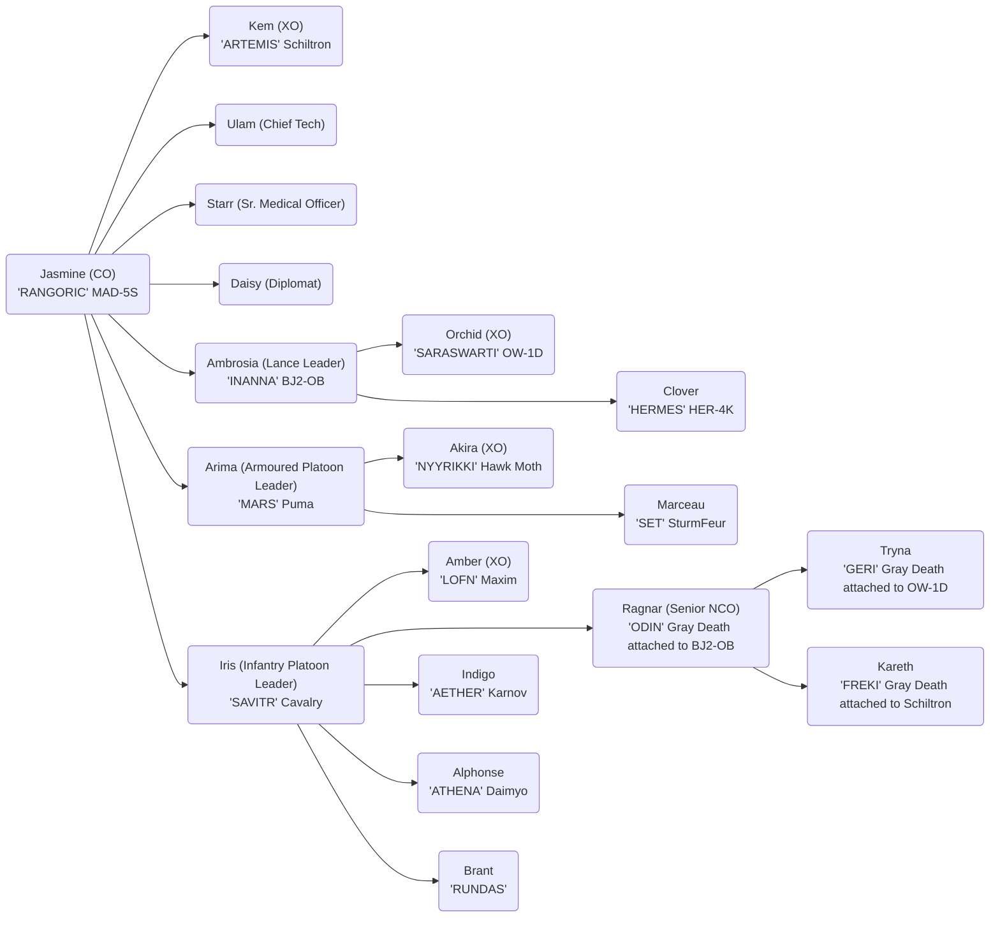
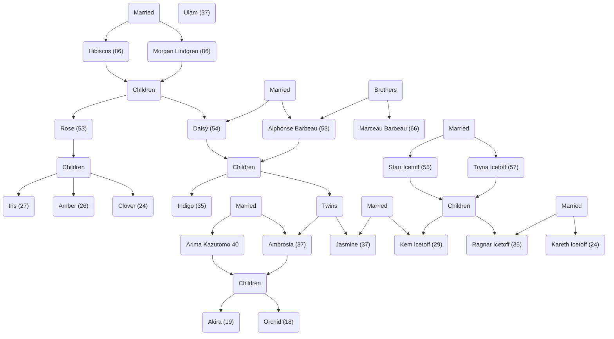

# Valkyries of Hanakotoba

The web app itself has most information, there are some charts left here because mermaid & mdx in general make a mess of things, but are a good starting point.

Pages Digested

VI
2, 1

https://bg.battletech.com/forums/index.php?topic=86040.msg2032846#msg2032846 has Fukuda Dai Ichizoku

III
49
