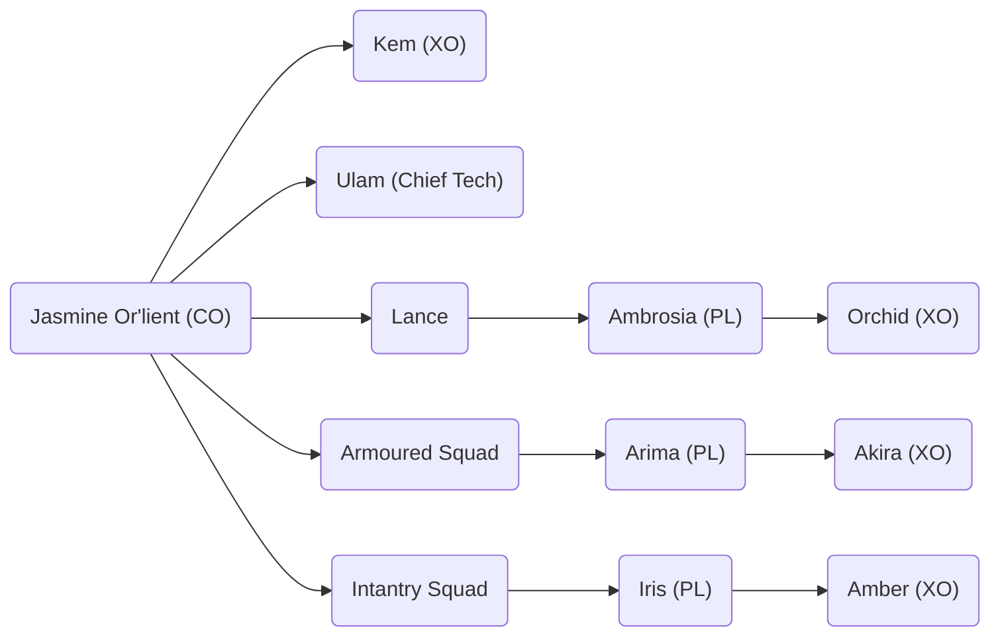

# Company Designation - Company Name

## Or'lient Family

Jasmine - Matriarch of the Family

- Ambrosia - Twin Sister
  - Arima Kazutomo - Husband
  - Akira - Son
  - Orchid - Daughter
- Daisy - Mother
- Alphonse Barbeau - Father
- Rose - Aunt, Daisy's younger sister
  - Iris - Daughter
  - Amber - Daughter
  - Clover - Son
- Ulam - Chief Tech
- Starr Icetoff - XO
  - Tryna Icetoff - Wife
  - Kem Icetoff - Daughter
  - Ragnar Icetoff - Son

Mechs:

- Heavy
  - Marauder MAD-3D
- Medium
  - Blackjack BJ2-OB
    - Ying Long Plasma
- Light
  - Raven RVN-4LC
  - Anubis ABS-3L

Combat Vehicles

- LRM Carrier
- Manteuffel Attack Tank Prime
  - Ying Long Plasma
- Ajax Attack Tank B
  - Ying Long Plasma
- Yellow Jacket Arrow IV or RAC/5

Infantry

- Karnov UR Transport BA
  - IS Standard LRR (4t)
  - IS Standard MG (4t)
- Cavalry Attack Helicopter Infantry
  - Infiltrator Mk II Sensor (4t)
- Maxim I Heavy Hover Transport
  - Tag Spotter Infantry Platoon (3t)
  - Heavy LRM Infantry Platoon (3t)
  - Foot Balistic Rifle Infantry (3t)
  - Scout Infantry Platoon (3t)
- Bandit Hovercraft H
  - Fenrir ERML (8t)
  - Ying Long Plasma (Outside)

References

- Marauder MAD-3D 3039 p497
- Blackjack BJ2-OB 3058 p232
- Raven RVN-4LC 3050 p63
- Anubis ABS-3L 3067 p70
- Ying Long Plasma (BA) 3075 p50
- LRM Carrier 3039 p123
- Manteuffel Attack Tank Prime 3067 p26
- Ajax Attack Tank B 3067 p38
- Yellow Jacket Arrow IV or RAC/5 3058 p63
- Karnov UR Transport BA 3058 p56
- IS Standard 3058 p40
- Cavalry Attack Helicopter Infantry 3058 p21
- Infiltrator Mk II Sensor 3058 p37
- Maxim I Heavy Hover Transport 3058 p112
- Heavy LRM Infantry Platoon 3085 Cutting Edge p329
- Tag Spotter Infantry Platoon 3085 Cutting Edge p329
- Bandit Hovercraft H 3058 p99
- Fenrir ERML 3058 Clan p62
