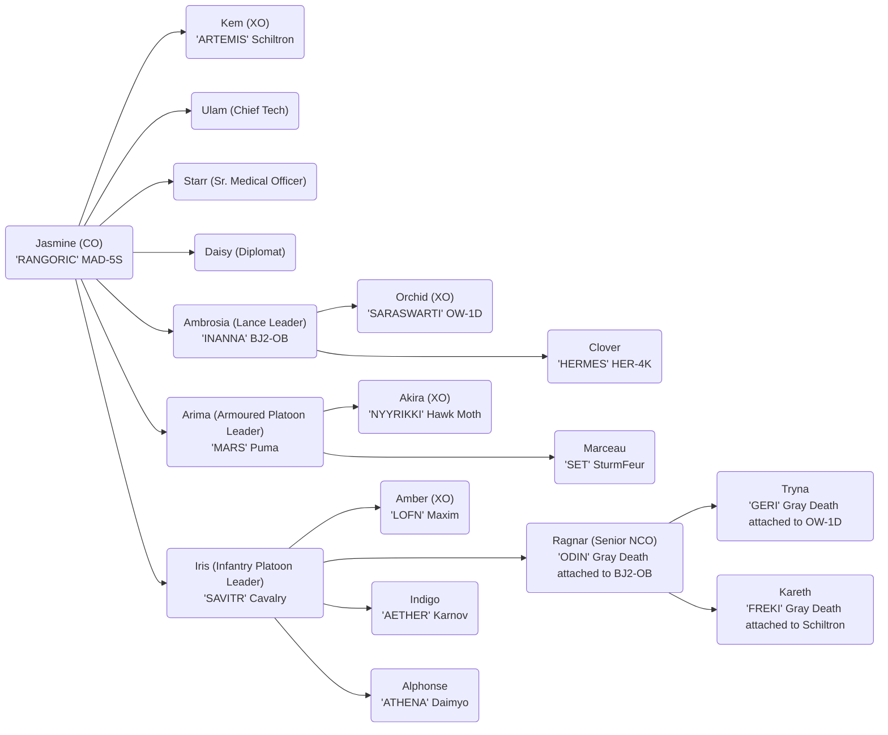

# Valkyries of Hanakotoba

## Officer List

### Unit Commanders

- CO: Jasmine Or'lient (Veteran)
- XO: Kem Icetoff

### Senior Officers

- Chief Technician: Ulam
- Sr. Medical Officer: Starr Icetoff
- Communications & Diplomatic Contact: Daisy Or'lient
- Senior NCO: Ragnar Icetoff

### Platoon Leaders

- Lance Platoon Leader: Ambrosia Or'lient (Regular+)
- Lance Platoon XO: Orchid Or'lient
- Armoured Platoon Leader: Arima Kazutomo
- Armoured Platoon XO: Akira Or'lient
- Infantry Platoon Leader: Iris Or'lient
- Infantry Platoon XO: Amber Or'lient

## Mechs

### Marauder MAD-5S (Heavy)

#### Weapons

| Name                  | Heat | Damage | Ranges    | Ammo |
| --------------------- | ---- | ------ | --------- | ---- |
| Gauss Rifle           | 1    | 15     | 2/7/15/22 | 8    |
| ER PPC x2             | 15   | 10     | -/7-14-23 | --   |
| Medium Pulse Laser x2 | 4    | 6      | /2/4/6    | --   |

### Blackjack BJ2-0B (Medium)

#### Weapons

| Name             | Heat | Damage | Ranges    | Ammo |
| ---------------- | ---- | ------ | --------- | ---- |
| Gauss Rifle      | 1    | 15     | 2/7/15/22 | 16   |
| LRM 10 w/Artemis | 4    | 1/msi  | 6/7/14/21 | 24   |
| Small Laser      | 1    | 3      | -/1/2/3   | --   |
| C3 Slave         |

#### OMNI Infantry Loaded

| Name                | Weapon      | Weight |
| ------------------- | ----------- | ------ |
| Gray Death Standard | Machine Gun | 4t     |

### Owens OW-1D (Light)

#### Weapons

| Name                | Heat | Damage | Ranges    | Ammo    |
| ------------------- | ---- | ------ | --------- | ------- |
| TAG                 | 0    | 0      | -/5-10-15 |
| Narc                | 0    | 0      | -/3/6/9   | 6       |
| SRM-4               | 3    | 2/msi  | -/3/6/9   | Narc 25 |
| C3 Slave            |
| Beagle Active Probe |      |        | 4         |

#### OMNI Infantry Loaded

| Name                | Weapon      | Weight |
| ------------------- | ----------- | ------ |
| Gray Death Standard | Machine Gun | 4t     |

### Hermes HER-4S (Light)

#### Weapons

| Name                  | Heat | Damage | Ranges | Ammo |
| --------------------- | ---- | ------ | ------ | ---- |
| Medium Pulse Laser x3 | 4    | 6      | /2/4/6 | --   |
| Guardian ECM Suite    |      |        | 6      |

## Armoured Platoon Vehicles

### Schiltron Prime

#### Weapons

| Name               | Damage | Ranges    | Ammo       |
| ------------------ | ------ | --------- | ---------- |
| Arrow IV x2        | 20     | -/1/2/8   | 20 Homing  |
|                    |        |           | 20 Regular |
| C3 Master (TAG)    | 0      | -/5/10/15 |
| Medium Laser       | 5      | -/3/6/9   |
| Small Laser        | 3      | -/1/2/3   |
| Guardian ECM Suite |        | 6         |

#### OMNI Infantry Loaded

| Name                | Weapon      | Weight |
| ------------------- | ----------- | ------ |
| Gray Death Standard | Machine Gun | 4t     |

### Sturmfeur Heavy Tank

#### Weapons

| Name        | Damage | Ranges    | Ammo |
| ----------- | ------ | --------- | ---- |
| LRM 20 x2   | 1/msi  | 6/7/14/21 | 18   |
| Machine Gun | 2      | -/1/2/3   | 200  |

### Puma Assault Tank PAT-005b

#### Weapons

| Name                | Damage | Ranges    | Ammo |
| ------------------- | ------ | --------- | ---- |
| ER PPC              | 10     | -/7/14/23 |
| LRM 20 x2 w/Artemis | 1/msi  | 6/7/14/21 | 24   |
| Medium Laser        | 5      | -/3/6/9   |
| Small Pulse Laser   | 3      | -/1/2/3   |
| Streak SRM-2        | 2/msi  | -/3/6/9   | 50   |
| Vehicle Flamer      | 2      | -/1/2/3   | 20   |

### Hawk Moth Gunship (Armour)

#### Weapons

| Name              | Damage | Ranges    | Ammo |
| ----------------- | ------ | --------- | ---- |
| Light Gauss Rifle | 8      | 3/8/17/25 | 16   |

## Infantry Platoon

### Karnov UR Transport BA

#### Weapons

| Name               | Damage | Ranges   | Ammo |
| ------------------ | ------ | -------- | ---- |
| Infantry Bay (8t)  |
| ER Medium Laser x2 | 5      | -/4/8/12 |
| Guardian ECM Suite |        | 6        |

#### Infantry Loaded

| Name                | Weapon                | Weight |
| ------------------- | --------------------- | ------ |
| Gray Death Standard | Machine Gun           | 4t     |
| Gray Death Standard | Long Recoilless Rifle | 4t     |

### Cavalry Attach Helicopter (Infantry)

#### Weapons

| Name              | Damage | Ranges  | Ammo |
| ----------------- | ------ | ------- | ---- |
| Infantry Bay (4t) |
| Medium Laser x3   | 5      | -/3/6/9 |
| Machine Gun x3    | 2      | -/1/2/3 | 100  |

#### Infantry Loaded

| Name                         | Weapon | Weight |
| ---------------------------- | ------ | ------ |
| Tag Spotter Infantry Platoon | TAG    | 3t     |

### Maxim I Heavy Hover Transport

#### Weapons

| Name               | Damage | Ranges    | Ammo |
| ------------------ | ------ | --------- | ---- |
| Infantry Bay (12t) |
| TAG                | 0      | -/5/10/15 |
| ER Medium Laser x2 | 5      | -/4/8/12  |
| Streak SRM-6       | 2/msi  | -/3/6/9   | 15   |

#### Loaded Infantry

| Name                         | Weapon   | Weight |
| ---------------------------- | -------- | ------ |
| Tag Spotter Infantry Platoon | TAG      | 3t     |
| Heavy LRM Infantry Platoon   | LRM      | 3t     |
| Conventional Infantry        | Flamer   | 3t     |
| Xenoplanetary Infantry       | Coolness | 3t     |

### Daimyo HQ 67-K

#### Weapons

| Name                          | Damage | Ranges    | Ammo |
| ----------------------------- | ------ | --------- | ---- |
| Infantry Bay (4t)             |
| Communications Equipment (7t) |
| Large Laser                   | 8      | -/5/10/15 |
| Machine Gun x4                | 2      | -/1/2/3   | 100  |

#### Infantry Loaded

| Name                | Weapon | Weight |
| ------------------- | ------ | ------ |
| Gray Death Standard | SRM    | 4t     |

## Availability and References

| Name                                 | List       | Availability | Book                      |
| ------------------------------------ | ---------- | ------------ | ------------------------- |
| Marauder MAD-5S                      | Rasalhague | 3051         | RS 3085 Phoenix p180      |
| Blackjack BJ2-0B                     | General    | 3057         | RS 3058 Inner Sphere p232 |
| Owens OW-1D                          | Mercenary  | 3056         | RS 3058 Inner Sphere p206 |
| Hermes HER-4S                        | Rasalhague | 3057         | RS 3050 Clan p235         |
| Schiltron Prime                      | Rasalhague | 3059         | RS 3060 p45               |
| Sturmfeur                            | Rasalhague | 3018         | RS 3039 p148              |
| Puma Assault Tank PAT-005b           | General    | 2751         | RS 3075 Age of War p14    |
| Harm Moth Gunship (Armour)           | Mercenary  | 3060         | RS 3060 p29               |
| Karnov UR Transport BA               | General    | 3063         | RS 3058 Inner Sphere p56  |
| Cavalry Attack Helicopter (Infantry) | General    | 3063         | RS 3058 p21               |
| Maxim I Heavy Hover Transport        | General    | 3060         | RS 3058 p123              |
| Daimyo HQ 67-K                       | Rasalhague | 2781         | RS 3075 Age of War p92    |
| Gray Death Standard (All)            | Mercenary  | 3052         | RS 3058 Clan p31          |
| Xenoplanetary Infantry               | Rasalhague | 3054         | RS 3085 The Cutting Edge  |
| Conventional Infantry (All)          | General    |              | RS 3085 The Cutting Edge  |
| Heavy LRM Infantry Platoon           | Rasalhague | 3057         | RS 3085 The Cutting Edge  |
