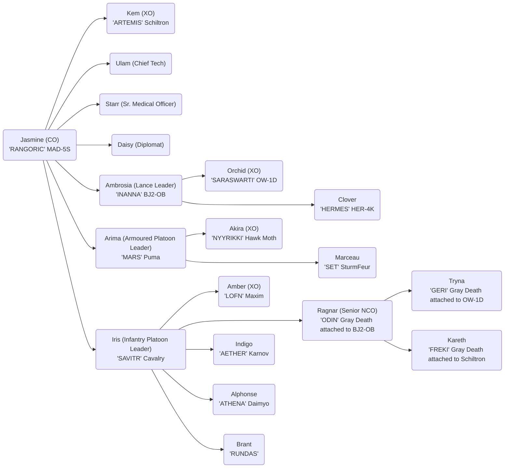

# Valkyries of Hanakotoba

## Officer List

### Unit Commanders

- CO: Jasmine Or'lient
- XO: Kem Icetoff

### Senior Officers

- Chief Technician: Ulam
- Sr. Medical Officer: Starr Icetoff
- Communications & Diplomatic Contact: Daisy Or'lient
- Senior NCO: Ragnar Icetoff

## Mech Units

- Lance Platoon Leader: Ambrosia Or'lient (Regular+)
- Lance Platoon XO: Orchid Or'lient

| Name                         | Unit                  | Stats | Missions | Notes                                | Book              |
| ---------------------------- | --------------------- | ----- | -------- | ------------------------------------ | ----------------- |
| `RANGORIC` Jasmine Or'lient  | MAD-5S                | 3/4   | 91       | Stock                                | 3085 Phoenix p180 |
| `INANNA` Ambrosia Or'lient   | BJ2-OB                | 3/5   | 90       | OMNI, FRR C3 Slave                   | 3058 IS p233      |
|                              | BJ2-OD Pod            |       |          | OMNI                                 | 3058 IS p235      |
| `ODIN` Ragnar Icetoff        | Gray Death Std Flamer | 4     | 90       | Mounted on BJ2-OB                    | 3058 Clan p31     |
| `SARASWARTI` Orchid Or'lient | OW-1D                 | 4/5   | 90       | OMNI, FRR C3 Slave, TAG, Probe, Narc | 3058 IS p206      |
| `GERI` Tryna Icetoff         | Gray Death Std Flamer | 4     | 90       | Mounted on OW-1D                     | 3058 Clan p31     |
| `HERMES` Clover Or'lient     | HER-4S                | 4/5   |          | ECM                                  | 3050 Clan p237    |

## Armoured Units

- Armoured Platoon Leader: Arima Kazutomo
- Armoured Platoon XO: Akira Or'lient

| Name                      | Unit                  | Stats | Missions | Notes                    | Book          |
| ------------------------- | --------------------- | ----- | -------- | ------------------------ | ------------- |
| `ARTEMIS` Kem Icetoff     | Schiltron Prime       | 4/5   | 90       | OMNI, FRR C3 Master, ECM | 3060 p45      |
|                           | Schiltron B           |       |          | OMNI, FRR C3 Master, ECM | 3060 p47      |
| `FREK` Karenth Icetoff    | Gray Death Std Flamer | 4     | 90       | Mounted on Schiltron     | 3058 Clan p31 |
| `SET` Marceau             | Sturmfeur             | 4/5   | 91       |                          | 3039 p148     |
| `MARS` Armia Kazutomo     | PAT-005b              | 4/5   |          |                          | 3075 AoW p14  |
| `NYYRIKKI` Akira Or'lient | Hawk Moth Gunship     | 4/5   | 91       |                          | 3060 p29      |

## Infantry Units

- Infantry Platoon Leader: Iris Or'lient
- Infantry Platoon XO: Amber Or'lient

| Name                      | Unit                           | Stats | Missions | Notes                   | Book          |
| ------------------------- | ------------------------------ | ----- | -------- | ----------------------- | ------------- |
| `AETHER` Indigo           | Karnov BA Transport            | 4/5   |          |                         | 3058 IS p56   |
|                           | Gray Death Std MG              | 4     |          | Mounted on Karnov       | 3058 Clan p33 |
|                           | Gray Death Std LRR             | 4     |          | Mounted on Karnov       | 3058 Clan p34 |
| `SAVITR` Iris Or'lient    | Cavalry Attack Heli (BA)       | 4/5   | 90       |                         | 3058 p21      |
| `RUNDAS` Brant Crowley    | Infantry Platoon TAG           | 4     | 90       | Mounted on Cavalry      | 3085 CE p330  |
| `LOFN` Amber Or'lient     | Maxim Heavy Transport          | 4/5   |          |                         | 3058 p123     |
|                           | Infantry Platoon TAG           | 4     |          | Mounted on Maxim        | 3085 CE p330  |
|                           | Infantry Platoon Heavy LRM     | 4     |          | Mounted on Maxim        | 3085 CE p329  |
|                           | Infantry Platoon Flamer        | 4     |          | Mounted on Maxim        |
|                           | Infantry Platoon Xenoplanetary | 4     |          | Mounted on Maxim        | 3085 CE p284  |
| `ATHENA` Alphonse Barbaue | HQ 67-K Daimyo                 | 4/5   | 91       | +2 Initiative           | 3075 AoW p92  |
|                           | Gray Death Std SRM             | 4     | 91       | Mounted on HQ 67-Daimyo | 3058 Clan p35 |

## Extra Gear

| Name                | Count | Ton Each | Total Tonnage | Notes     |
| ------------------- | ----- | -------- | ------------- | --------- |
| Ferro Fibrous Armor | 5.5   | 1        | 5.5           | 99 Points |

## Inner Sphere Supplier

| Name                 | Count | Ton Each | Total Tonnage | Notes               |
| -------------------- | ----- | -------- | ------------- | ------------------- |
| Ferro Fibrous Armor  | 5.5   | 1        | 5.5           | 99 Points           |
| Arrow IV Homing Ammo | 2     | 1        | 2             | 10 Rounds           |
| Arrow IV Homing Ammo | 5     | 1        | 5             | 25 Rounds           |
| Arrow IV Homing Ammo | 1     | 1        | 1             | 05 Rounds           |
| LRM Artemis IV Ammo  | 6     | 1        | 6             | 144/76/48/36 Rounds |
| LRM Semi-Guided Ammo | 2     | 1        | 2             | 48/24/16/12 Rounds  |
| LRM Thunder Ammo     | 2     | 1        | 2             | 48/24/16/12 Rounds  |
| SRM Tear Gas         | 1     | 1        | 1             | 50 Rounds           |
