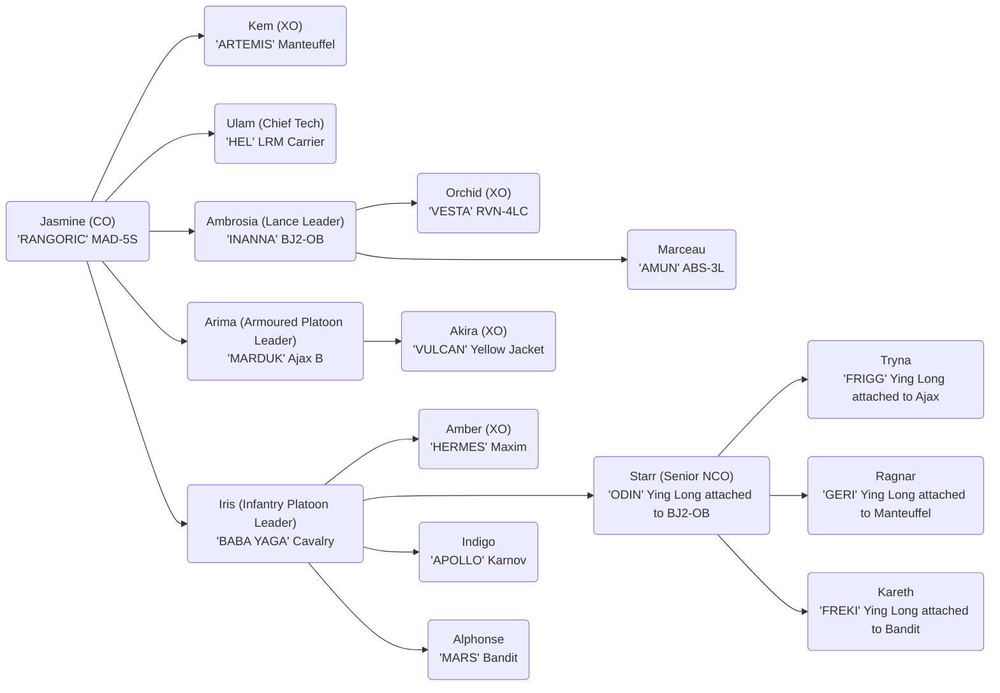

# Company Designation - Company Name

## Or'lient Family

Jasmine - Matriarch

- Ambrosia - Twin Sister
  - Arima Kazutomo - Husband
  - Akira - Son
  - Orchid - Daughter
- Indigo - Younger Brother
- Daisy - Mother
- Alphonse Barbeau - Father
- Marceau Barbeau - Uncle, Father's older brother
  - Irene Barbeau - Wife
- Rose - Aunt, Daisy's younger sister
  - Iris - Daughter
  - Amber - Daughter
  - Clover - Son
- Ulam - Tech Since being personal tech
- Starr Icetoff
  - Tryna Icetoff - Wife
  - Kem Icetoff - Daughter
  - Ragnar Icetoff - Son
    - Kareth Icetoff - Wife

Veteren - Jasmine

Regular+ - Ambrosia

Mechs:

- Heavy
  - Marauder MAD-5S - (Rasalhague 3051)
- Medium
  - Blackjack BJ2-0B - (General 3057)
    - BA Slot
- Light
  - Wolfhound WLF-2 (Rasalhague 3052)
  - Hermes HER-4S (Rasalhague 3057)

Combat Vehicles

- Schiltron Prime (Rasalhague 3059)
  - BA Slot
- Sturmfeur Heavy Tank (Rasalhague 3018)
- Yellow Jacket RAC (General 3066)
- LRM Carrier (3055 Upgrade) - (General 2470/3055)

Infantry

- Karnov UR Transport BA (General)
  - IS Standard LRR (4t)
  - IS Standard MG (4t)
- Cavalry Attack Helicopter Infantry (General)
  - Infiltrator Mk II Sensor (4t)
- Maxim I Heavy Hover Transport - (General)
  - Tag Spotter Infantry Platoon (3t)
  - Heavy LRM Infantry Platoon (3t)
  - Foot Ballistic Rifle Infantry (3t)
  - Scout Infantry Platoon (3t)
- Bandit Hovercraft H
  - Fenrir ERML (8t)
  - Ying Long Plasma (Outside)

References

- Marauder MAD-5S 3085 Phoenix p180
- Blackjack BJ2-OB 3058 p232
- Wolfhound WLF-2 3050 Inner Sphere p66
- Hermes HER-4K 3050 Clan p235
- Anubis ABS-3L 3067 p70
- Ying Long Plasma (BA) 3075 p50
- LRM Carrier (3055 Upgrade) 3058 IS p132
- Schiltron Prime (3060 p45)
- Yellow Jacket Arrow IV or RAC/5 3058 p63
- Karnov UR Transport BA 3058 p56
- IS Standard 3058 p40
- Cavalry Attack Helicopter Infantry 3058 p21
- Infiltrator Mk II Sensor 3058 p37
- Maxim I Heavy Hover Transport 3058 p112
- Heavy LRM Infantry Platoon 3085 Cutting Edge p329
- Tag Spotter Infantry Platoon 3085 Cutting Edge p329
- Bandit Hovercraft H 3058 p99
- Fenrir ERML 3058 Clan p62
