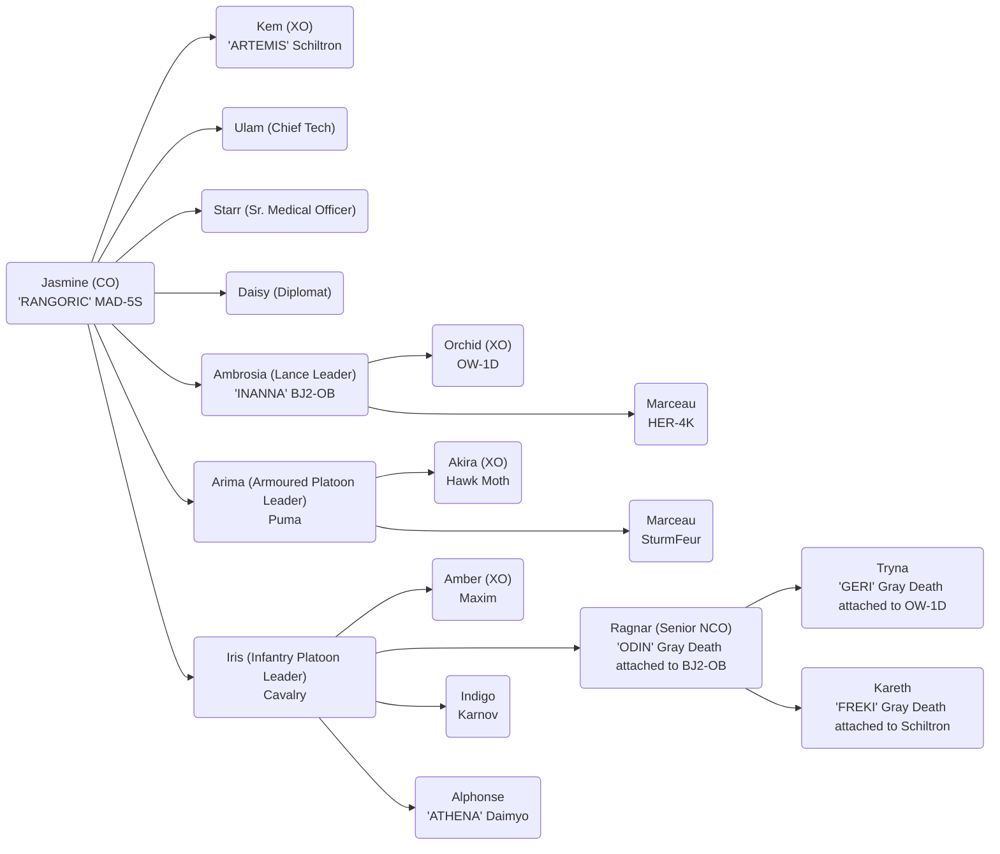

# Company Designation - Company Name

## Officer List

### Unit Commanders

- CO: Jasmine Or'lient (Veteran)
- XO: Kem Icetoff

### Senior Officers

- Chief Technician: Ulam
- Sr. Medical Officer: Starr Icetoff
- Communications & Diplomatic Contact: Daisy Or'lient
- Senior NCO: Ragnar Icetoff

### Platoon Leaders

- Lance Platoon Leader: Ambrosia Or'lient (Regular+)
- Lance Platoon XO: Orchid Or'lient
- Armoured Platoon Leader: Arima Kazutomo
- Armoured Platoon XO: Akira Or'lient
- Infantry Platoon Leader: Iris Or'lient
- Infantry Platoon XO: Amber Or'lient

## Mechs

### Marauder MAD-5S (Heavy)

Rasalhague (3051)

(Book: RS 3085 Phoenix p180)

#### Weapons

| Name                  | Heat | Damage | Ranges    | Ammo |
| --------------------- | ---- | ------ | --------- | ---- |
| Gauss Rifle           | 1    | 15     | 2/7/15/22 | 8    |
| ER PPC x2             | 15   | 10     | -/7-14-23 | --   |
| Medium Pulse Laser x2 | 4    | 6      | /2/4/6    | --   |

### Blackjack BJ2-0B (Medium)

General (3057)

(Book: RS 3058 Inner Sphere p232)

#### Equipment

C3 Slave

#### Weapons

| Name             | Heat | Damage | Ranges    | Ammo |
| ---------------- | ---- | ------ | --------- | ---- |
| Gauss Rifle      | 1    | 15     | 2/7/15/22 | 16   |
| LRM 10 w/Artemis | 4    | 1/msi  | 6/7/14/21 | 24   |
| Small Laser      | 1    | 3      | -/1/2/3   | --   |

#### OMNI Mounted Battle Armour

##### Gray Death Standard (Flamer)

Merc (3052)

(Book: RS 3058 Clan p31)

###### Weapons & Equipment

| Name             | Damage | Ranges  | Ammo |
| ---------------- | ------ | ------- | ---- |
| Battle Claw      |
| Flamer           | 2      | -/1/2/3 |
| Improved Sensors |        | 2       |

### Owens OW-1D (Light)

Merc (3056)

(Book: RS 3058 Inner Sphere p206)

#### Equipment

C3 Slave

Beagle Active Probe (4)

#### Weapons

| Name  | Heat | Damage | Ranges    | Ammo    |
| ----- | ---- | ------ | --------- | ------- |
| TAG   | 0    | 0      | -/5-10-15 |
| Narc  | 0    | 0      | -/3/6/9   | 6       |
| SRM-4 | 3    | 2/msi  | -/3/6/9   | Narc 25 |

#### OMNI Mounted Battle Armour

##### Gray Death Standard (Flamer)

Merc (3052)

(Book: RS 3058 Clan p31)

###### Weapons & Equipment

| Name             | Damage | Ranges  | Ammo |
| ---------------- | ------ | ------- | ---- |
| Battle Claw      |
| Flamer           | 2      | -/1/2/3 |
| Improved Sensors |        | 2       |

### Hermes HER-4S

Rasalhague (3057)

(Book: RS 3050 Clan p235)

#### Equipment

Guardian ECM Suite (6)

#### Weapons

| Name                  | Heat | Damage | Ranges | Ammo |
| --------------------- | ---- | ------ | ------ | ---- |
| Medium Pulse Laser x2 | 4    | 6      | /2/4/6 | --   |

## Armoured Platoon Vehicles

### Schiltron Prime

Rasalhague (3059)

(Book: RS 3060 p45)

#### Equipment

C3 Master

Guardian ECM Suite (6)

#### Weapons

| Name         | Damage | Ranges    | Ammo       |
| ------------ | ------ | --------- | ---------- |
| Arrow IV x2  | 20     | -/1/2/8   | 20 Homing  |
|              |        |           | 20 Regular |
| TAG          | 0      | -/5/10/15 |
| Medium Laser | 5      | -/3/6/9   |
| Small Laser  | 3      | -/1/2/3   |

#### OMNI Mounted Battle Armour

##### Gray Death Standard (Flamer)

Merc (3052)

(Book: RS 3058 Clan p31)

###### Weapons & Equipment

| Name             | Damage | Ranges  | Ammo |
| ---------------- | ------ | ------- | ---- |
| Battle Claw      |
| Flamer           | 2      | -/1/2/3 |
| Improved Sensors |        | 2       |

### Sturmfeur Heavy Tank

Rasalhague 3018

(Book: RS 3039 p148)

#### Weapons

| Name        | Damage | Ranges    | Ammo |
| ----------- | ------ | --------- | ---- |
| LRM 20      | 1/msi  | 6/7/14/21 | 18   |
| Machine Gun | 2      | -/1/2/3   | 200  |

### Puma Assault Tank PAT-005b

General (2751)

(Book: RS 3075 Age of War p14)

#### Weapons

| Name                | Damage | Ranges    | Ammo |
| ------------------- | ------ | --------- | ---- |
| ER PPC              | 10     | -/7/14/23 |
| LRM 20 x2 w/Artemis | 1/msi  | 6/7/14/21 | 24   |
| Medium Laser        | 5      | -/3/6/9   |
| Small Pulse Laser   | 3      | -/1/2/3   |
| Streak SRM-2        | 2/msi  | -/3/6/9   | 50   |
| Vehicle Flamer      | 2      | -/1/2/3   | 20   |

### Hawk Moth Gunship (Armour)

Merc (3060)

(Book: RS 3060 p29)

#### Weapons

| Name              | Damage | Ranges    | Ammo |
| ----------------- | ------ | --------- | ---- |
| Light Gauss Rifle | 8      | 3/8/17/25 | 16   |

## Infantry Platoon

Infantry

- Karnov UR Transport BA (8t) (General 3063)
  - Gray Death Standard (MG) (4t)
  - Gray Death Standard (LRR) (4t)
- Cavalry Attack Helicopter Infantry (4t) (General 3063)
  - TAG Spotter Infantry Platoon (3t)
- Maxim I Heavy Hover Transport (12t) (General 3060)
  - TAG Spotter Infantry Platoon (3t)
  - Conventional Infantry w/SRM (3t)
  - Conventional Infantry w/Flamer (3t)
  - Xenoplanetary Infantry (3t)
- Daimyo HQ 67-K (4t) (Rasalhague 2781)
  - Gray Death Standard (SRM) (4t)

References

- Karnov UR Transport BA 3058 p56
- Cavalry Attack Helicopter Infantry 3058 p21
- Maxim I Heavy Hover Transport 3058 p112

| Name              | Heat                   | Damage  | Ranges | Ammo |
| ----------------- | ---------------------- | ------- | ------ | ---- |
| Schiltron Prime   | Arrow IV x2            | 1/2/8   |
| Movement 3/5      | Medium Laser x2        | 3/6/9   |
|                   | Small Laser x4         | 1/2/3   |
|                   | Guardian ECM Suite     | 6       |
|                   | C3 Master (Tag)        | 5/10/15 |
|                   |                        |         |
| SturmFeur         | LRM 20 x2              | 7/14/21 |
| Movement: 3/5     | Machine Gun            | 1/2/3   |
|                   |                        |         |
| Puma Assault Tank | Medium Laser x2        | 3/6/9   |
| Movement 3/5      | Stream SRM 2 x2        | 3/6/9   |
|                   | ER PPC                 | 7/14/23 |
|                   | LRM 20 w/Artemis IV x2 | 7/14/21 |
|                   | Small Pulse Laser      | 1/2/3   |
|                   | Flamer                 | 1/2/3   |
